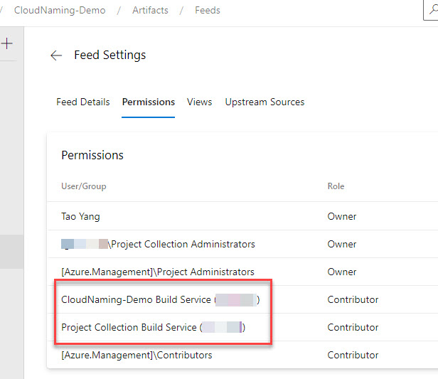

# CloudNaming Module Demo Pipelines

## Pipelines

### azure-pipelines-demo-1.yaml

* Install CloudNaming module from a Organization-Level Azure Artifact feed (Internal to the organization).
* Use default configuration file from the module
* Generate resource names one at a time (basic usage)

### azure-pipelines-demo-2.yaml

* Install CloudNaming module from Public PowerShell Gallery repository.
* Uses a custom configuration file from the `config` folder.
* Generate multiple resource names in one command (advanced scenario)

### azure-pipelines-install-azure-artifacts.yaml

* Publishes a customized version of the CloudNaming module to an Azure Artifacts organization-level feed.

> **NOTE**: To publish the module to an organization-level Azure Artifacts feed, you need to grant the following permissions to the feed:

